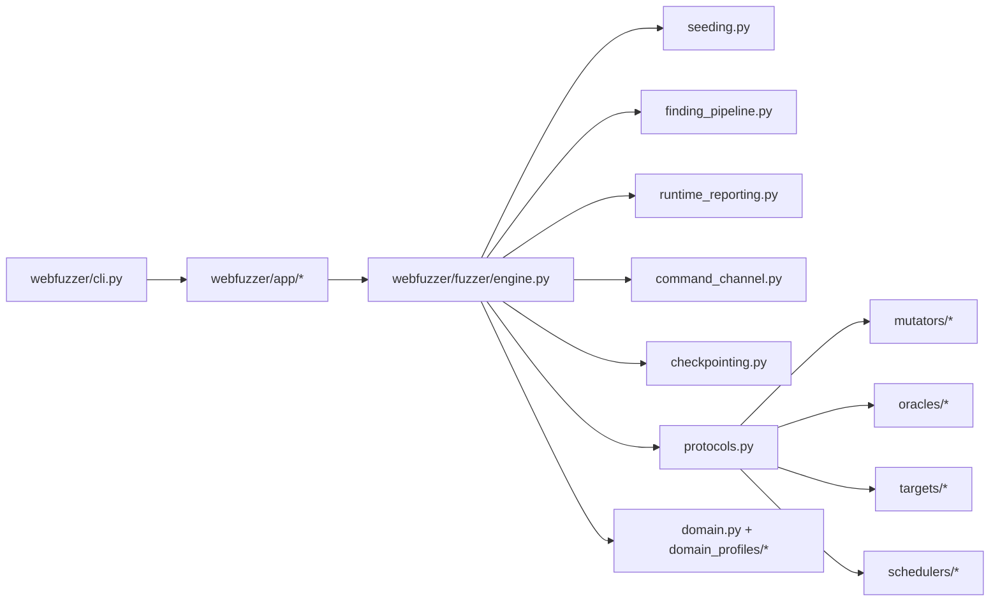

# Architecture Overview

This document is the shortest path to understanding how the project is wired today.

## What This Project Is

`webfuzzer` is a grammar-driven differential fuzzing framework.

At a high level it:

1. Builds an input from a grammar or mutates an existing corpus seed.
2. Executes the input against one or more targets.
3. Collects coverage and oracle results.
4. Stores interesting seeds and findings.
5. Repeats the loop while optional heuristic guidance, targeted mutation, and
   domain-specific feedback may bias the search.

## Main Runtime Flow

## Directory Map

### `webfuzzer/core`

Grammar parsing, registry, and generation primitives.

- Read this when you need to understand how grammars are loaded or expanded.
- Usually stable and high-cohesion.

### `webfuzzer/app`

Runtime assembly layer used by the CLI.

- `campaigns.py`: preset flag bundles
- `persistent_targets.py`: persistent process command mapping
- `factories/targets.py`: target construction
- `factories/mutators.py`: mutator assembly
- `factories/oracles.py`: oracle assembly
- `factories/schedulers.py`: scheduler assembly
- `factories/coverage.py`: coverage collector assembly
- `factories/differential.py`: differential oracle wiring
- `research_hooks.py`: optional external research artifact loading/application
- `experimental_features.py`: experimental guidance and targeted-mutation assembly

If you want to know "how does a CLI flag become a concrete runtime object?", start here.

### `webfuzzer/fuzzer`

Runtime orchestration and shared abstractions.

- `protocols.py`: swappable component contracts
- `engine.py`: main fuzzing loop and orchestration
- `seeding.py`: initial corpus population
- `finding_pipeline.py`: finding normalization, dedup, publishing, stats
- `runtime_reporting.py`: status and artifact persistence
- `targeted_mutation.py`: optional targeted follow-up execution lifecycle
- `command_channel.py`: stdin command processing
- `checkpointing.py`: checkpoint save/load
- `corpus.py`: seed storage and global coverage state
- `domain.py`: registry/bootstrap for built-in domain profiles
- `domain_model.py`: `DomainProfile`, `DangerRung`, `compute_danger`
- `domain_registry.py`: registration and derived views
- `domain_profiles/*`: built-in profile declarations grouped by area

### `webfuzzer/guidance`

Experimental guidance hooks that bias mutation and prioritize interesting
structure. The current analyzers are regex/AST based and should not be treated
as deep static analysis.

### `webfuzzer/fuzzer/concolic`

Experimental targeted follow-up input generation. Some modes use constraints,
some use property correlations, and some use source/coverage hints. Treat this
as targeted mutation, not as a fully validated concolic engine.

### External Research Hooks

The CLI still accepts several imports from external research workspaces:

- `--lattice-atoms`
- `--automaton-witnesses`
- `--stopping-signal`
- `--dedup-atoms`
- `--implication-base`
- `--diff-trace`
- `--feature-dump`

Keep those paths optional and off by default. Do not make them prerequisites
for the normal fuzzer runtime. See `docs/methodology-status.md` for the current
status of each method.

Runtime wiring for these hooks belongs in `webfuzzer/app/research_hooks.py`.
The CLI should pass paths and options through; it should not parse or apply
research artifacts directly.

## Recommended Reading Order

For a new human or AI agent, the most efficient order is:

1. `webfuzzer/fuzzer/protocols.py`
2. `webfuzzer/cli.py`
3. `webfuzzer/app/factories/__init__.py`
4. `webfuzzer/app/factories/targets.py`
5. `webfuzzer/fuzzer/engine.py`
6. `webfuzzer/fuzzer/seeding.py`
7. `webfuzzer/fuzzer/finding_pipeline.py`
8. `webfuzzer/fuzzer/domain.py`
9. `webfuzzer/fuzzer/domain_profiles/*`
10. One concrete mutator, target, and oracle relevant to your task

Why this order works:

- `protocols.py` tells you the contracts first.
- `cli.py` shows how the program is entered.
- `app/*` shows how runtime pieces are chosen.
- `engine.py` shows the control loop.
- `domain*` files show where cross-cutting domain knowledge lives.

## Current Boundaries

### What `cli.py` should do

- Parse arguments
- Apply campaign presets
- Build runtime objects through `webfuzzer/app/*`
- Start the engine

Experimental feature construction should stay in `webfuzzer/app/*` helpers.
Avoid adding more artifact parsing, strategy boosts, or coordinator selection
directly to `cli.py`.

### What `engine.py` should do

- Coordinate the main loop
- Call services for seeding, finding processing, reporting, commands, and checkpointing
- Talk to components via protocols where possible

### What should not go back into `engine.py`

- Large target factory logic
- Campaign preset tables
- Domain profile declarations
- Report file formatting
- Checkpoint serialization details

## Common Change Map

When you need to make a change, start here:

| Goal | Start Here | Usually Also Touch |
| --- | --- | --- |
| Add a CLI option | `webfuzzer/cli.py` | `webfuzzer/app/factories/*`, `webfuzzer/app/campaigns.py` |
| Add a new target type | `webfuzzer/app/factories/targets.py` | target implementation under `targets/*` |
| Add a mutator | `webfuzzer/app/factories/mutators.py` | `webfuzzer/fuzzer/mutators/*`, maybe `protocols.py` |
| Add an oracle | `webfuzzer/app/factories/oracles.py` | `webfuzzer/fuzzer/oracles/*` |
| Add a scheduler | `webfuzzer/app/factories/schedulers.py` | `webfuzzer/fuzzer/schedulers/*` |
| Add a domain profile | `webfuzzer/fuzzer/domain_profiles/*` | maybe `webfuzzer/fuzzer/domain_model.py` if a new concept is needed |
| Change finding persistence | `webfuzzer/fuzzer/finding_pipeline.py` | `runtime_reporting.py`, `stats.py` |
| Change initial seeding | `webfuzzer/fuzzer/seeding.py` | `cli.py`, `grammar_source.py` |
| Change checkpoint format | `webfuzzer/fuzzer/checkpointing.py` | `engine.py` only if new callbacks are needed |
| Add external research input | Prefer `docs/methodology-status.md` first | CLI flag only if optional and ignored safely |
| Add a research artifact hook | `webfuzzer/app/research_hooks.py` | `protocols.py` only if a new capability contract is needed |
| Add an experimental runtime feature | `webfuzzer/app/experimental_features.py` | a small service under `webfuzzer/fuzzer/*` if it needs loop callbacks |

## Optional Protocols

Many components only implement the base protocol plus a few optional capabilities.

Look in `webfuzzer/fuzzer/protocols.py` for these contracts:

- `ScheduleFeedbackInputSource`
- `StrategyWeightProvider`
- `LearnedWeightMutator`
- `StrategyFeedbackMutator`
- `ExceptionHintMutator`
- `ResettableMutatorWeights`
- `GuidanceWeightedMutator`
- `CleanupAwareSeedScheduler`

If you see behavior in the engine that only applies to some components, the first thing to check is whether one of these optional protocols is involved.

## Built-In Domain Profiles

Built-in profiles are intentionally grouped, not scattered:

- `domain_profiles/foundation_profiles.py`: core protocol and parser-oriented domains
- `domain_profiles/web_input_profiles.py`: browser, markup, auth input domains
- `domain_profiles/exploit_profiles.py`: exploit and sink-oriented domains

`domain.py` only bootstraps those groups into the shared registry.

## Design Rules For Future Changes

Prefer these patterns:

- Put assembly logic in `webfuzzer/app/*`.
- Put runtime orchestration in `webfuzzer/fuzzer/*`.
- Put data declarations in `domain_profiles/*`.
- Put optional behavior behind a protocol before adding more `hasattr(...)`.
- Keep `engine.py` focused on flow, not long tables or serialization details.
- Mark unvalidated methodology as experimental in docs and CLI help.

Avoid these patterns:

- Adding new large `if/elif` assembly trees in `cli.py`
- Hiding new extension points behind string checks when a protocol would work
- Putting more built-in domain declarations back into `domain.py`
- Presenting paper-inspired heuristics as validated methodology without
  reproducible campaign evidence

